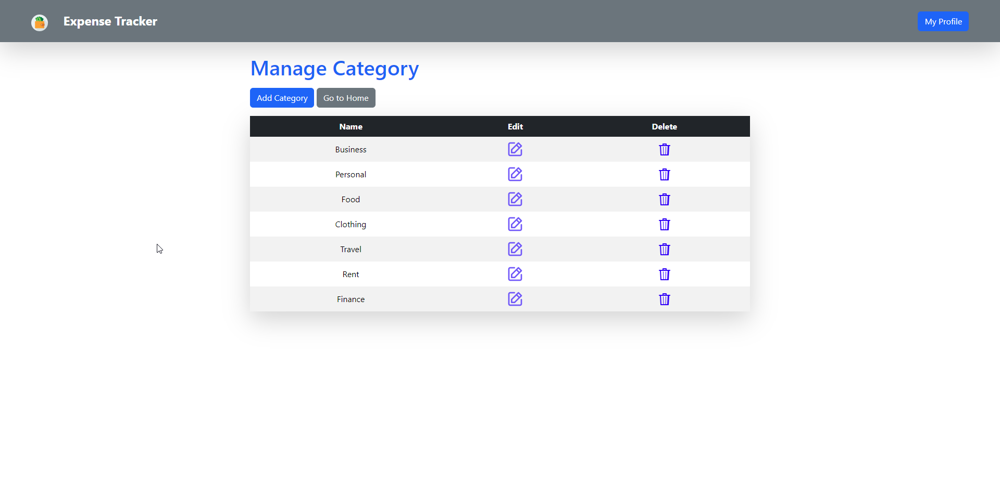

# Expense Tracker

#### The following features are added in this Expense Tracker application

- This **Expense Tracker** application is used to calculate expense based on daily expense we have added.
- It will show the calculated expense of **Last 7 days**, **Last 30 days**, **Last 365 days**.
- It shows calculated sum of expense for each days in **past 30 days**.
- It shows calculated sum of expenses in each category.
- It shows pie chart for **Expense vs Category**
- It shows line chart for **Expense sum vs Each day** for past 30 days.
- The users can add their **own categories** and add their expense relevent to their own categories.

#### Applicaton Screenshots

- **Login Page**
  
- **Registration Page**
  
- **Expense Page**
  
- **Manage Category Page**
  
- **Add Category Page**
  
- **Delete Category Page**
  
- **Add Expense Page**
  
- **Delete Expense Page**
  
- **My Expenses Page**
  
- **Expenses Page when no expense**
  
- **Expense Pie chart and Line chart**
  
- **Calculate Expenses**
  
